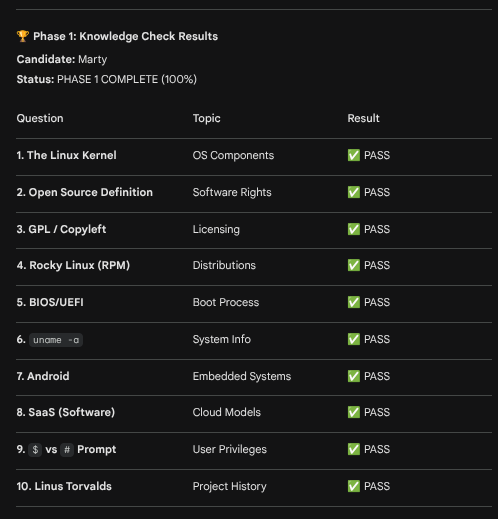

# 🐧 LPI Linux Essentials Study Plan (12 Weeks)

This repository tracks my journey to passing the **LPI Linux Essentials (010-160)** exam. 

## 🏗️ The Lab Environment
- **Host:** Fedora Linux
- **Nested Hypervisor:** Proxmox VE 8.x (running inside virt-manager)
- **Study Nodes:** - Debian 12 (Target for APT/Debian family testing)
  - Rocky Linux 9 (Target for DNF/Red Hat family testing)

## 📅 Progress Tracker
- [x] **Phase 1: Environment & Evolution** (Weeks 1-3)
- [ ] **Phase 2: The Power of the CLI** (Weeks 4-6)
- [ ] **Phase 3: Hardware & Security** (Weeks 7-9)
- [ ] **Phase 4: Networking & Final Review** (Weeks 10-12)

## 🔗 Quick Links
- [View Lab Setup Guide](./Lab-Setup.md)
- [Week 1: Evolution & Philosophy](./Phase-01-Basics/Week-01.md)
- [Week 1: Knowledge Check](./Quizzes/Week-01-Quiz.md)

## 🏅 Certification Progress

